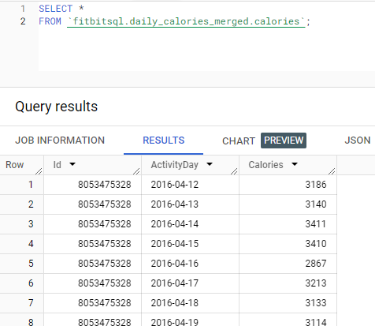
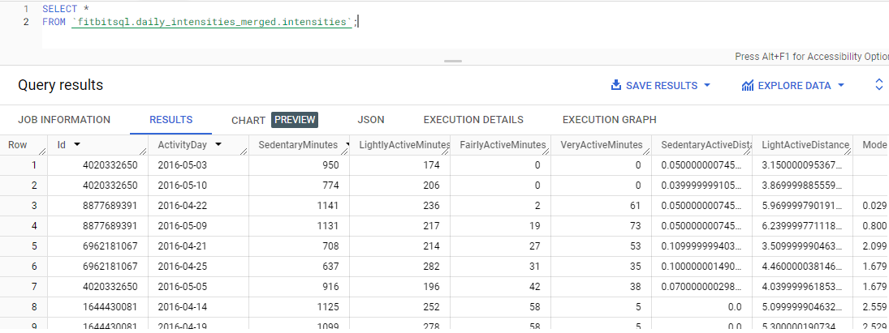
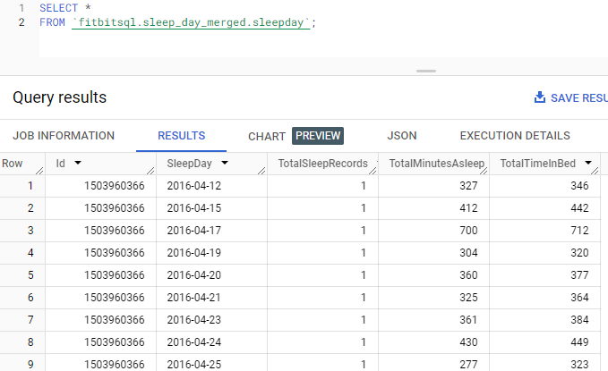

# FitBit Tracker Data Analysis

## Introduction
Welcome to the FitBit Tracker Data Analysis project, where I dive into the world of smart device fitness data to unlock new growth opportunities for **Bellabeat**. Bellabeat, a rising star in the global smart device market, believes in empowering women through data. Our mission in this project is to analyze fitness data from smart devices, focusing on the Bellabeat app, to uncover insights that could propel Bellabeat to new heights.

## Bellabeat: Harnessing Health Data

Urška Sršen, co-founder and Chief Creative Officer of Bellabeat believes that analyzing smart device fitness data could help unlock new growth opportunities for the company. They offer different smart devices that collect data on activity, sleep, stress, and reproductive health to empower women with knowledge about their own health and habits. The main objective of this case is to analyze smart device fitness data and determine how it could help unlock new growth opportunities for Bellabeat. We will focus on one of Bellabeat’s products: the Bellabeat app.

The Bellabeat app provides users with health data related to their activity, sleep, stress, menstrual cycle, and mindfulness habits. This data can help users better understand their current habits and make healthy decisions. The Bellabeat app connects to their line of smart wellness products.

## Method Approach:

In this project, I will use 6 steps to ensure my project's completion:

1: Ask

2: Prepare

3: Process

4: Analyze

5: Share

6: Act

## Step 1: Ask:

**Objective:**
My aim is to identify trends in how consumers use Bellabeat devices. Understanding these usage patterns is essential for developing strategies to foster growth opportunities for Bellabeat and enhance its marketing strategies.

**Deliverables:**

- A clear summary of the project objective.
  
- A full documentation of all the data cleaning, manipulation, and analysis.

- Dashboards with visualizations and main outcomes.

- Recommendation based on insights and analysis.

## Step 2: Prepare

For this study, I am using datasets from the FitBit Fitness Tracker Data, shared by Möbius on Kaggle under the CC0: Public Domain Creative Commons License. Out of the 18 available datasets, I selected 7 that provide a broad view of the quantitative data tracked by Fitbit devices.
[FitBit Fitness Tracker Data](https://www.kaggle.com/datasets/arashnic/fitbit).

 **The 7 datasets I chose for this project:**
 - dailyActivity_merged.csv
 - dailyCalories_merged.csv
 - dailyIntensities_merged.csv
 - dailySteps_merged.csv
 - heartrate_seconds_merged.csv
 - sleepDay_merged.csv
 - weightLogInfo_merged.csv

## Dataset Insights and Limitations:

I have downloaded and extracted the data from zip files into CSV formats for ease of analysis. Each dataset represents a different aspect of the data tracked by Fitbit. It's important to note that the data, covering a 31-day period from April 12, 2016, to May 12, 2016, is somewhat dated. Moreover, the absence of demographic information like gender, location, and age in the data presents certain limitations. Despite these challenges, the insights drawn from this data are valuable and form the core of my analysis.

## Step 3: Process:

To begin processing the data, I used Python(Pandas) in Jupyter Notebook  to import the datasets and do the process of cleaning and organizing. The cleaning process included adjusting data type formats, removing duplicates, and imputing missing values with "Unknown". Then I extracted the clean data to new CSV files and stored it.

## Importing Datasets:

After converting some date-related data into "Date" format, I opened [BigQuery Console](https://console.cloud.google.com/bigquery?sq=471986406107:e0ed61bf16a548ac87f7686062183cee). Then selected "Create Project". Typed down the name of the project I am going to explore, in this case, I used **FitBitSQL**. I created a new dataset for Bellabeat and named it **fitbitsql**. Inside fitbitsql dataset, I imported the cleaned CSV datasets.

After that, I started my work to analyze the data to identify trends using **BigQuery** for **SQL** and **Tableau** for **Visualizations**.

## Step 4: Analyze 

Using BigQuery, I ensured that all datasets were imported successfully.

After importing all the datasets successfully in BigQuery, I'll perform **exploratory data analysis (EDA)**  with my input on the FitBit Tracker Datasets. A list of tasks will be answered followed by the query input and query result.

**Query 1:** What is the average number of steps taken per day by each user?

The data above shows, that the users have a wide range of average daily steps, suggesting variability in daily activity levels. The variability suggests that each user has a unique pattern of activity, which could be influenced by many factors, such as lifestyle, fitness level, daily routine, or even the accuracy and consistency of wearing the Fitbit device.

**Query 2:** On which day did each user burn the most calories, and how many calories were burned?

From the query results displayed, we can see:

- Each row corresponds to a different user (identified by their unique Id).
  
- ActivityDay shows the specific date on which that user burned the most calories.
  
- Calories show the number of calories burned on that day.

This analysis provides a snapshot of peak activity levels for each user, which could be useful for identifying patterns or trends in user behavior, assessing the effectiveness of workout programs, or tailoring personalized fitness challenges to encourage increased calorie burn.

**Query 3:** How does daily total distance vary across different days for each user?

The data above shows that there is considerable variation in the total distance covered by the same user on different days. The distances covered vary not only within individual users but also across different users. This information could be used to identify days when users are particularly active or inactive, analyze weekly or monthly trends in physical activity, and possibly correlate these distances with other factors such as users' goals, weather conditions, or health events. It can also help in personalizing fitness challenges or goals based on individual activity levels.

**Query 4:** What are the average sleep time and average sedentary time for each user?

From the query results, we can observe that:

There is a significant range in both average sleep time and sedentary time among users. These findings indicate diverse patterns in sleep and sedentary behavior among the users. The data could potentially be used to identify correlations between sleep and sedentary times and to develop personalized interventions to improve sleep patterns and reduce sedentary behavior.

**Query 5:** Which users have the highest variability in their heart rate readings?

