# FitBit Tracker Data Analysis

## Introduction
Welcome to the FitBit Tracker Data Analysis project, where I dive into the world of smart device fitness data to unlock new growth opportunities for **Bellabeat**. Bellabeat, a rising star in the global smart device market, believes in empowering women through data. Our mission in this project is to analyze fitness data from smart devices, focusing on the Bellabeat app, to uncover insights that could propel Bellabeat to new heights.

## Bellabeat: Harnessing Health Data

Urška Sršen, co-founder and Chief Creative Officer of Bellabeat believes that analyzing smart device fitness data could help unlock new growth opportunities for the company. They offer different smart devices that collect data on activity, sleep, stress, and reproductive health to empower women with knowledge about their own health and habits. The main objective of this case is to analyze smart device fitness data and determine how it could help unlock new growth opportunities for Bellabeat. We will focus on one of Bellabeat’s products: the Bellabeat app.

The Bellabeat app provides users with health data related to their activity, sleep, stress, menstrual cycle, and mindfulness habits. This data can help users better understand their current habits and make healthy decisions. The Bellabeat app connects to their line of smart wellness products.

## Method Approach:

In this project, I will use 6 steps to ensure my project's completion:

1: Ask

2: Prepare

3: Process

4: Analyze

5: Share

6: Act

## Step 1: Ask:

**Objective:**
My aim is to identify trends in how consumers use Bellabeat devices. Understanding these usage patterns is essential for developing strategies to foster growth opportunities for Bellabeat and enhance its marketing strategies.

**Deliverables:**

- A clear summary of the project objective.
  
- A full documentation of all the data cleaning, manipulation, and analysis.

- Dashboards with visualizations and main outcomes.

- Recommendation based on insights and analysis.

## Step 2: Prepare

For this study, I am using datasets from the FitBit Fitness Tracker Data, shared by Möbius on Kaggle under the CC0: Public Domain Creative Commons License. Out of the 18 available datasets, I selected 7 that provide a broad view of the quantitative data tracked by Fitbit devices.
[FitBit Fitness Tracker Data](https://www.kaggle.com/datasets/arashnic/fitbit).

 **The 7 datasets I chose for this project:**
 - dailyActivity_merged.csv
 - dailyCalories_merged.csv
 - dailyIntensities_merged.csv
 - dailySteps_merged.csv
 - heartrate_seconds_merged.csv
 - sleepDay_merged.csv
 - weightLogInfo_merged.csv

## Dataset Insights and Limitations:

I have downloaded and extracted the data from zip files into CSV formats for ease of analysis. Each dataset represents a different aspect of the data tracked by Fitbit. It's important to note that the data, covering a 31-day period from April 12, 2016, to May 12, 2016, is somewhat dated. Moreover, the absence of demographic information like gender, location, and age in the data presents certain limitations. Despite these challenges, the insights drawn from this data are valuable and form the core of my analysis.

## Step 3: Process:

To begin processing the data, I used Python(Pandas) in Jupyter Notebook  to import the datasets and do the process of cleaning and organizing. The cleaning process included adjusting data type formats, removing duplicates, and imputing missing values with "Unknown". Then I extracted the clean data to new CSV files and stored it.

## Importing Datasets:

After converting some date-related data into "Date" format, I opened [BigQuery Console](https://console.cloud.google.com/bigquery?sq=471986406107:e0ed61bf16a548ac87f7686062183cee). Then selected "Create Project". Typed down the name of the project I am going to explore, in this case, I used **FitBitSQL**. I created a new dataset for Bellabeat and named it **fitbitsql**. Inside fitbitsql dataset, I imported the cleaned CSV datasets.

After that, I started my work to analyze the data to identify trends using **BigQuery** for **SQL** and **Tableau** for **Visualizations**.

## Step 4: Analyze 

Using BigQuery, I ensured that all datasets were imported successfully.

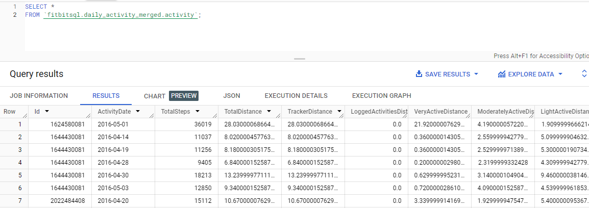

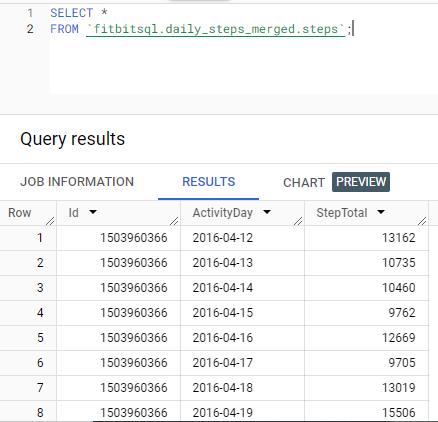

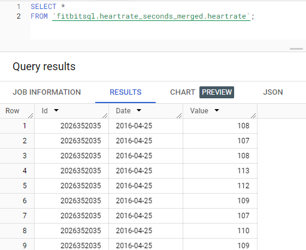

After importing all the datasets successfully in BigQuery, I'll perform **exploratory data analysis (EDA)**  with my input on the FitBit Tracker Datasets. A list of tasks will be answered followed by the query input and query result.

### **Query 1:** What is the average number of steps taken per day by each user?

The data above shows, that the users have a wide range of average daily steps, suggesting variability in daily activity levels. The variability suggests that each user has a unique pattern of activity, which could be influenced by many factors, such as lifestyle, fitness level, daily routine, or even the accuracy and consistency of wearing the Fitbit device.

### **Query 2:** On which day did each user burn the most calories, and how many calories were burned?

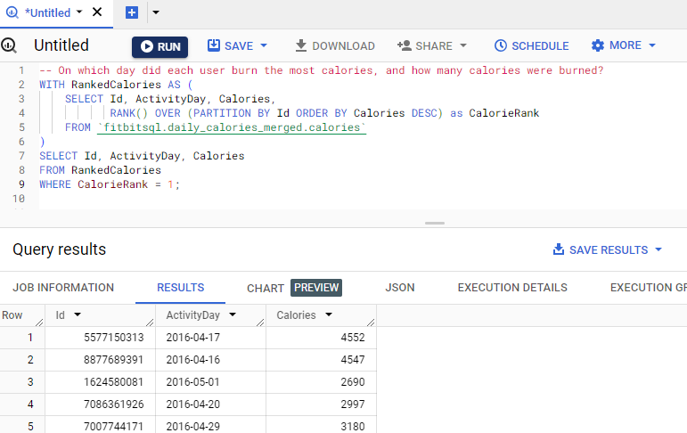

From the query results displayed, we can see:

- Each row corresponds to a different user (identified by their unique Id).
  
- ActivityDay shows the specific date on which that user burned the most calories.
  
- Calories show the number of calories burned on that day.

This analysis provides a snapshot of peak activity levels for each user, which could be useful for identifying patterns or trends in user behavior, assessing the effectiveness of workout programs, or tailoring personalized fitness challenges to encourage increased calorie burn.

### **Query 3:** How does daily total distance vary across different days for each user?

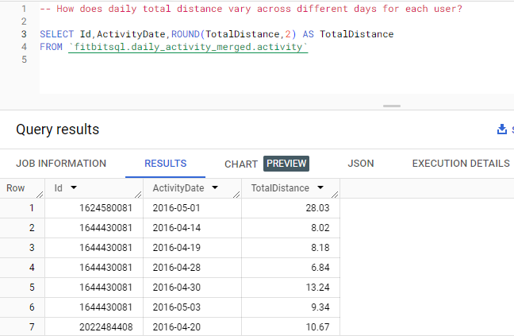

The data above shows that there is considerable variation in the total distance covered by the same user on different days. The distances covered vary not only within individual users but also across different users. This information could be used to identify days when users are particularly active or inactive, analyze weekly or monthly trends in physical activity, and possibly correlate these distances with other factors such as users' goals, weather conditions, or health events. It can also help in personalizing fitness challenges or goals based on individual activity levels.

### **Query 4:** What are the average sleep time and average sedentary time for each user?

From the query results, we can observe that:

There is a significant range in both average sleep time and sedentary time among users. These findings indicate diverse patterns in sleep and sedentary behavior among the users. The data could potentially be used to identify correlations between sleep and sedentary times and to develop personalized interventions to improve sleep patterns and reduce sedentary behavior.

### **Query 5:** Which users have the highest variability in their heart rate readings?

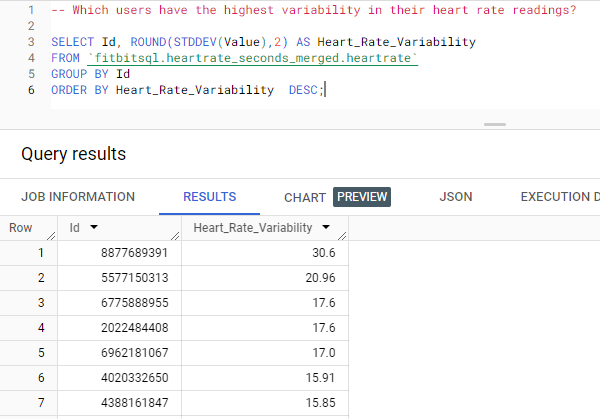

The SQL query assesses heart rate variability by calculating the standard deviation of heart rate readings per user, and the results indeed show varying levels of heart rate variability among the users. The dataset includes users with both relatively high and lower heart rate variability, which could reflect differences in fitness levels, stress, or other health-related factors.

### **Query 6**: How does the weight of users change over time?

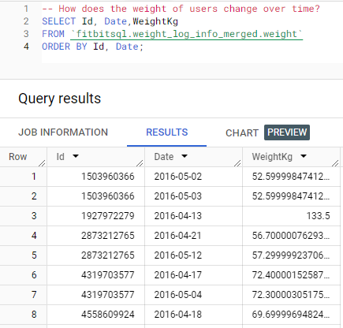

The above data shows that there is a range of weights among different users, demonstrating the diversity in the dataset. The dates suggest that the data is not from a fixed daily record; some users have measurements that are days apart, while others have longer intervals. This data could be used to track weight changes over time for individual users, which may be helpful for understanding long-term weight trends, the effectiveness of weight management programs, or health outcomes related to weight changes.

### **Query 7***: What is the distribution of active vs sedentary minutes for each user?

The query results present a distribution of daily minutes spent in various activity intensities for a group of users on a specific date. It appears that there is a notable variation in activity levels among the users. Some individuals have a mix of lightly active minutes and sedentary minutes, while others are exclusively sedentary for the entire day. Sedentary minutes dominate the users' records, which suggests either a non-active lifestyle or potential inaccuracies in data capture (possibly not wearing the device). The high number of sedentary minutes for some users raises questions about their daily routines or the accuracy and wear-time of the fitness trackers. This data could inform health and wellness initiatives aimed at increasing overall physical activity and reducing sedentary behavior.

### **Query 8:** What are the total steps and total distance covered by each user on days when they were highly active?

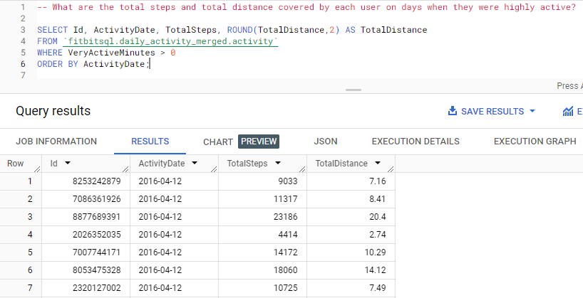

The query results show the total steps taken and total distance covered by users on a day when they had recorded very active minutes. Some users had a highly active day. The distances covered are consistent with the step counts, indicating more steps correlate to greater distances. The variability in the data suggests different levels of intensity or duration in users' active pursuits. This data could be indicative of users' fitness levels or could reflect the nature of their activities on that day. 

### **Query 9:** What is the average BMI of users, and how does it relate to their average active minutes?

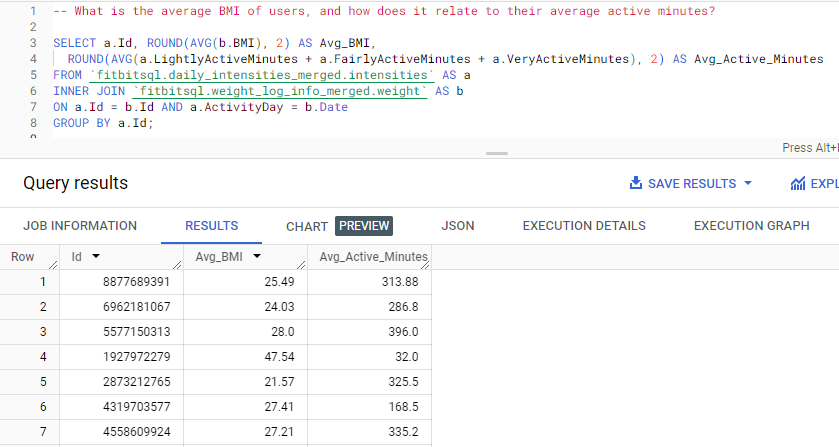

The data shows each user's average Body Mass Index (BMI) which is a measure of body fat based on height and weight and how much time they spend being active. BMI varies widely among users and the amount of active time each day ranges from a little to a lot. There's no clear pattern that links BMI with how active people are. Some users with higher BMI are more active, possibly working on getting fitter. One user with a very high BMI isn't very active, which might be an area to focus on for health improvements. This information helps us see if there's a link between how much people weigh and how active they are.

### **Query 10** What is the highest heart rate reached by each user on each day?

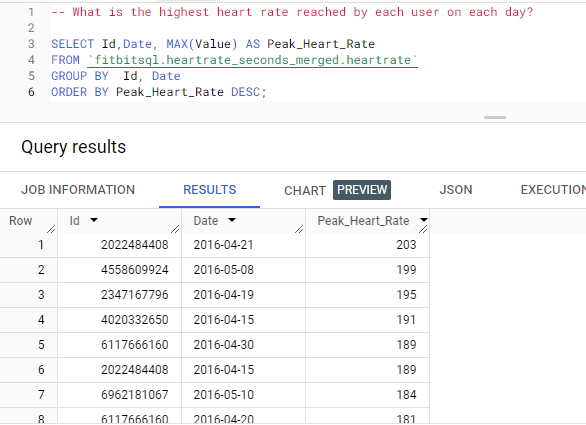

The data lists the highest heart rate recorded for different users on various days. It shows that heart rates reached as high as 203 beats per minute on the days recorded. The heart rates suggest that users may have been engaging in intense exercise or other activities that significantly raised their heart rates on these days. This kind of information could be useful for understanding each user's exercise intensity and cardiovascular health.

### **Query 11:**  How does sleep quality relate to the total calories burned?

The data from the query provides information on how much time each user spent asleep and in bed, as well as the number of calories they burned. It appears there's a mix of sleep times and calories burned among users. For example, one user slept for 327 minutes and burned 1985 calories, while another slept more, at 503 minutes, but burned fewer calories, totaling 1459. This might suggest that there isn't a straightforward relationship between the amount of sleep and calories burned. 

### **Query 12:** How many calories does each user burn on average during weekdays versus weekends?

The query results show the average number of calories burned by users on weekdays compared to weekends. For example, user 1503960366 burned an average of 1811 calories on weekdays and 1832 on weekends. Another user, 1642508001, burned fewer calories on average during weekdays (1414.87) compared to the weekend (1680.25). This suggests that some people might be more active and burn more calories on weekends, but this is not a consistent pattern for everyone, as seen in the varied calorie counts. The data could be useful for understanding how activity levels change on different days of the week.

### **Query 13:** What is the combined overview of each user's daily activity, including steps, sleep, and calories burned?

This query produced the following result:

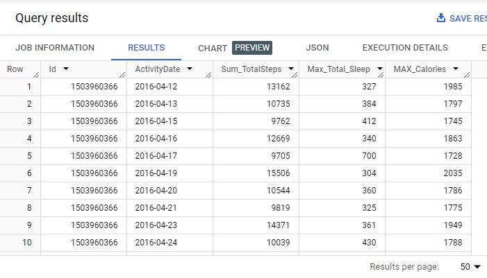

The SQL query combines data on each user's daily steps, sleep, and calories burned. The results for user 1503960366 show variations in daily activity over several days in April 2016. For instance, on April 12, this user walked 13,162 steps, slept for 327 minutes, and burned 1,985 calories. On April 17, the user slept more, for 700 minutes, but walked fewer steps and burned fewer calories than on April 12. The data indicates that there's no consistent pattern between the number of steps taken, time spent sleeping, and calories burned for this user across the different days. This kind of information could help understand a person’s activity levels and rest patterns, which can be important for health and fitness monitoring.

### **Query 14:** How do users' weekly activity levels correlate with changes in their weight?

The above SQL query produces the following result:

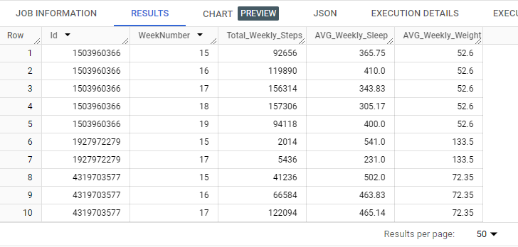

The SQL query combines weekly data on users' activity levels, sleep, and weight. It shows, for instance, that user 1503960366 took more steps in week 17 than in week 15, but the average weight remained the same at 52.6 kg across weeks 15 to 19. Another user, 1927972279, showed a decrease in weekly steps and sleep from week 15 to 17, with the weight remaining constant at 133.5 kg. This suggests that within the given time frame, changes in weekly activity and sleep do not necessarily correlate with changes in weight for these users. This kind of analysis could help evaluate the impact of activity and sleep on weight management over time.

### **Query 15:** What is the relationship between users' active minutes and their average heart rate on the same day?

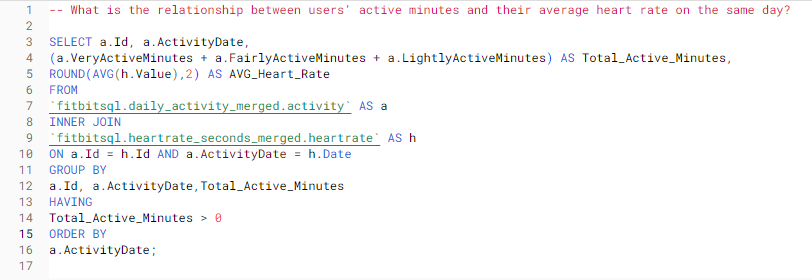

This query produced the following result:

The data suggests that on the same day, some people were more active and generally had a higher heart rate. However, the relationship isn't consistent across all users—some have fewer active minutes but still have a high average heart rate. This might tell us that people's heart rates can be influenced by more than just how active they are, such as individual fitness levels or the intensity of the activity.

### **Query 16:** How does users' physical activity during the day impact their sleep patterns?

The above SQL query produces the following result:

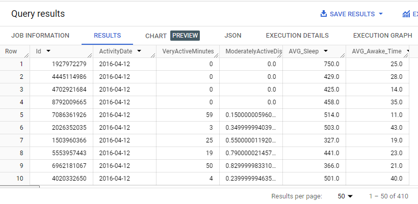

The query is trying to see if there is a pattern like "the more active you are, the better you sleep," but the results are mixed. Some people who are more active don't necessarily sleep more or have less awake time in bed, and vice versa. This suggests that activity level and sleep quality might be related, but it's not a simple one-to-one relationship, and other factors could also be influencing sleep.

### **Query 17:** How does the weekly total active minutes and calories burned correlate with the changes in users' weight over time?

The above SQL query produces the following result:

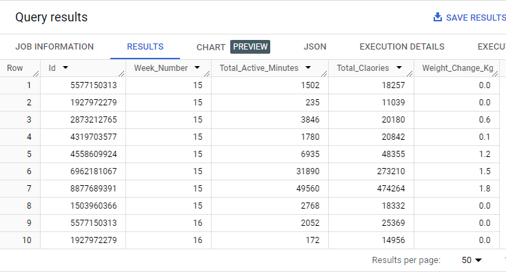

The SQL query assesses how the total active minutes and total calories burned each week relate to weight changes for different users. The results for week 15 show varied activity levels and calorie burn, with some users burning a lot of calories and showing a weight change, while others don't. The query suggests a possible connection between being active, burning calories, and changes in weight, but it's not consistent across all cases. The weight change could be influenced by many factors, not just activity and calorie burn. This kind of analysis could help understand what contributes to weight loss or gain over time.

### **Query 18:** What is the difference in users' resting heart rate on days with high activity compared to days with low activity?

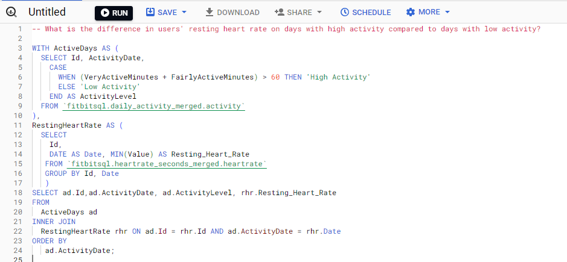

The above SQL query produces the following result:

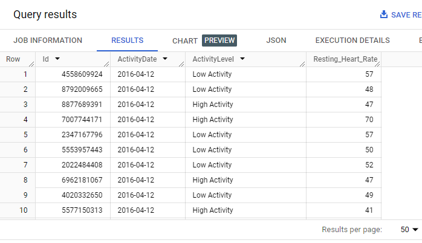

The analysis compares users' resting heart rates on active days versus less active days. Results are mixed; some have a lower resting heart rate on active days, while others don't, indicating no clear link between daily activity levels and resting heart rate for the users on this specific day. It could mean that many other factors affect a person's heart rate beyond how much they move in a day.

### **Query 19:** How does users' daily activity and intensity relate to their sleep efficiency?

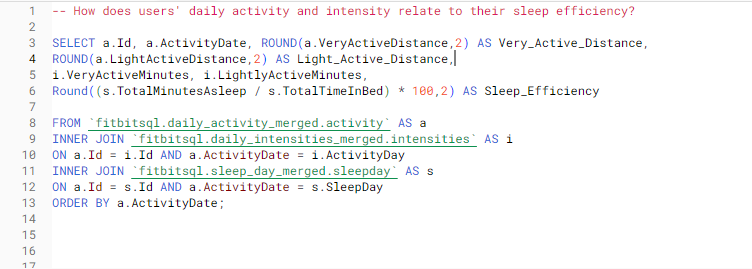

This query produced the following result:

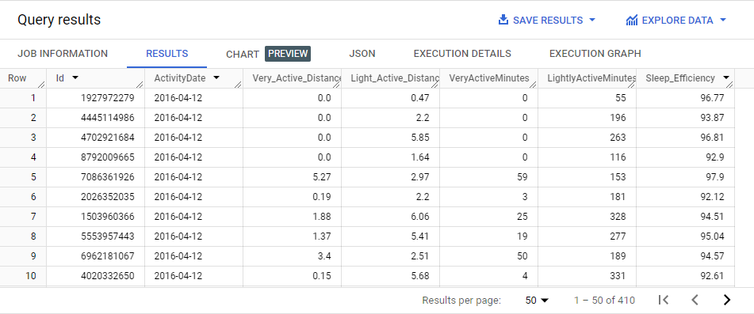

The SQL query explores how users' daily physical activities correlate with their sleep efficiency. From the results, we can see that sleep efficiency varies among users, ranging from around 92% to nearly 97%. However, there isn't a clear and consistent pattern that indicates whether more active users have higher sleep efficiency. Some users with more active minutes or distance seem to have high sleep efficiency, while others with similar activity levels have lower sleep efficiency. The mixed results suggest that the relationship between daily activity and sleep quality is not straightforward and might be influenced by other factors.

## Step 5: Share

In this crucial step of my FitBit Tracker Data Analysis project, I present my findings and insights derived from my comprehensive analysis. This phase is pivotal for turning my analytical efforts into actionable strategies for Bellabeat.

Sharing the Tableau Dashboards:

### Dashboard 1: User Activity Patterns

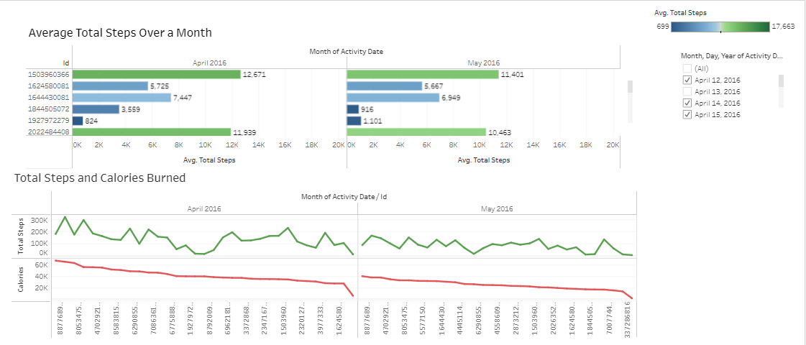

The dashboard provides a clear visual summary of fitness activity, specifically tracking the average daily steps and calorie burn for a group of individuals over April and May 2016. It highlights:

**Average Daily Steps:** It identifies the most and least active individuals based on their average daily steps. The top user had an average of over 12,000 steps in April and around 11,400 in May.

**Activity and Calorie Trends:** The daily fluctuations in steps and calories burned are tracked, showing a correlation between the number of steps taken and the calories burned. A notable peak in activity occurred in mid-April, where the highest daily steps exceeded 17,000.

### Dashboard 2: Caloric Expenditure

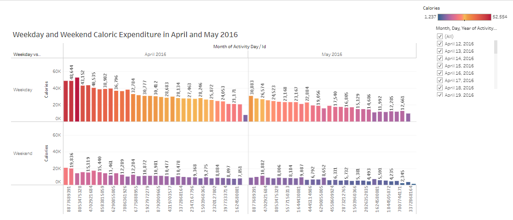

The dashboard shows the number of calories burned during weekdays and weekends across April and May 2016. Each bar represents a day:

**Weekdays (Red and Orange Bars):** The colors range from dark red to light orange, representing the number of calories burned. Darker red bars indicate higher calorie burn. It seems that during weekdays, calorie expenditure fluctuates but generally stays within a range, with some days showing significantly higher calorie burn.

**Weekends (Purple and Blue Bars):** The weekends are shown in shades of purple and blue, with darker colors indicating more calories burned. Compared to weekdays, weekends tend to have a lower calorie burn, but there are exceptions where some weekends show a high-calorie expenditure.

### Dashboard 3: Sleep and Heart Rate Analysis

The chart shows two different sets of health data for several people over April and May 2016:

**Heart Rate:** The top part shows the highest and lowest heart rate recorded for each person in each month. For example, one person's heart rate ranged from 38 to 203 beats per minute in April. This wide range might indicate periods of intense exercise or stress and times of rest or relaxation.

**Sleep Pattern:** The bottom part tracks how much time each person spends in bed, which might not be the same as actual sleep time. For instance, in April, one person had times in bed that ranged from around 3,000 to over 10,000 minutes total for the month. This can show us who is getting more rest and who might not be getting enough.

***The link to the interactive dashboard will be found under the screenshot below.***

[Tableau Dashboard](https://public.tableau.com/app/profile/jannatul.hashi/viz/FitBitTrackerData/Sheet1?publish=yes)

## Step 6: Act

After a comprehensive analysis of the FitBit Tracker data, I've gathered valuable insights that can guide actionable strategies for Bellabeat. Here are my key conclusions and recommendations:

### Conclusions:

- **User Activity Patterns:** I observed significant variations in users' daily activity levels. Some users consistently maintained high levels of daily steps, while others had more fluctuating activity patterns. This suggests a diverse user base with different fitness habits.

- **Caloric Expenditure:** Weekdays generally exhibited more consistent calorie expenditure compared to weekends. While weekdays showed variations, weekends occasionally had unusually high-calorie burns. This information could be leveraged for targeted marketing campaigns or promotions.

- **Sleep and Heart Rate Analysis:** Heart rate data revealed wide-ranging heart rate levels among users, indicating varying levels of physical activity, stress, and rest. Sleep patterns also varied, with some users getting more rest than others. Individualized strategies for stress management and sleep improvement could be explored.

- **Weight Changes:** Weight changes over time did not consistently correlate with changes in activity levels or calorie burn. Factors beyond physical activity likely contribute to weight fluctuations. Personalized weight management plans could be beneficial.

### Recommendations:

- **Personalized Fitness Programs:** I recommend developing personalized fitness programs within the Bellabeat app to cater to users with different activity patterns. Encourage users to set achievable goals based on their current fitness levels.

- **Weekend Wellness Promotions:** Consider offering weekend-specific wellness promotions or challenges to incentivize users to stay active during weekends. This can help improve overall weekly calorie expenditure.

- **Stress Management:** Introduce stress management features in the Bellabeat app, such as guided meditation or stress tracking. These features can assist users in managing their stress levels, potentially reflected in more stable heart rate data.

- **Sleep Improvement:** Provide sleep improvement recommendations to users with irregular sleep patterns. Tailored sleep schedules and relaxation techniques could be integrated into the app.

- **Holistic Health Approach:** Promote a holistic approach to health by emphasizing that weight management is influenced by multiple factors, including diet, sleep, stress, and physical activity. Encourage users to focus on overall well-being rather than just weight.

- **Continuous Monitoring:** Implement continuous monitoring of user data to track the effectiveness of my recommendations and programs. Regularly update and refine strategies based on user feedback and data analysis.

- **User Engagement:** Enhance user engagement by regularly sharing personalized insights and progress reports. Gamify fitness challenges to keep users motivated and engaged with the Bellabeat ecosystem.

- **Research and Development:** Invest in ongoing research and development to stay at the forefront of health and wellness technology. Explore partnerships with fitness experts, nutritionists, and sleep specialists to offer comprehensive solutions.

By acting on these conclusions and recommendations, BellaBeat can empower its users to lead healthier lives while strengthening its position in the smart device market. The data-driven approach will enable BellaBeat to deliver meaningful value to users and drive sustainable growth.

